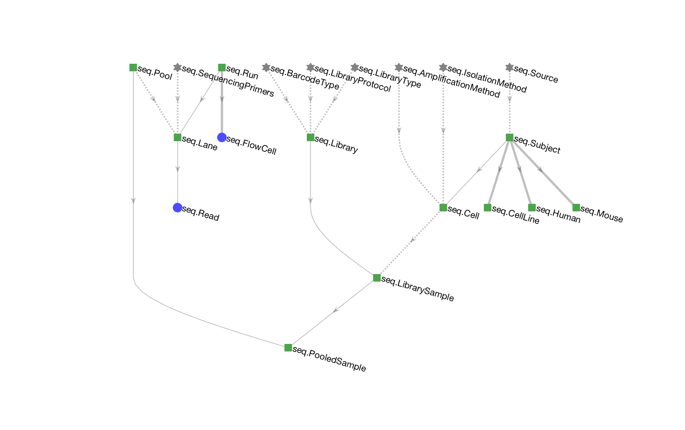

# Sequencing Pipeline

# Working with the pipeline (in Python)
The DataJoint library is implemented in MATLAB and Python.  

The documentation can be found here:
* https://github.com/datajoint/wiki/wiki -- this is where the most recent documentation is being edited.
* https://datajoint.github.io
* Post issues at https://github.com/datajoint/datajoint-python/issues
* Get ongoing help at https://datajoint.slack.com

# A minimal example
A minimal example for navigating and querying the `seq` database in python is found here: [notebooks/Minimal.ipynb]

